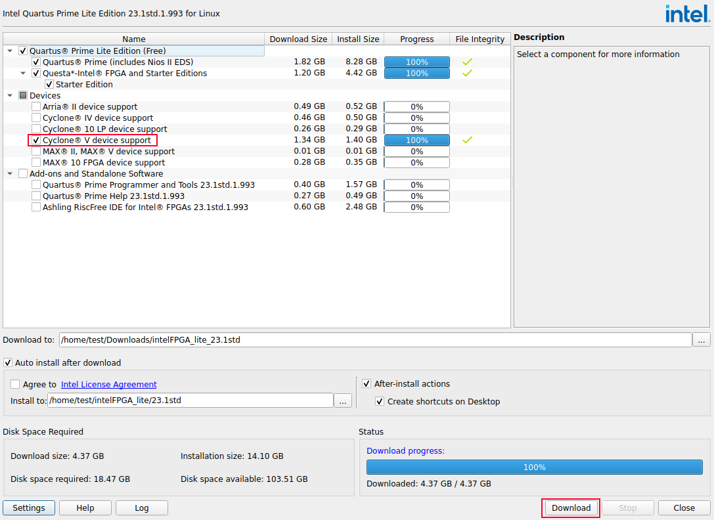
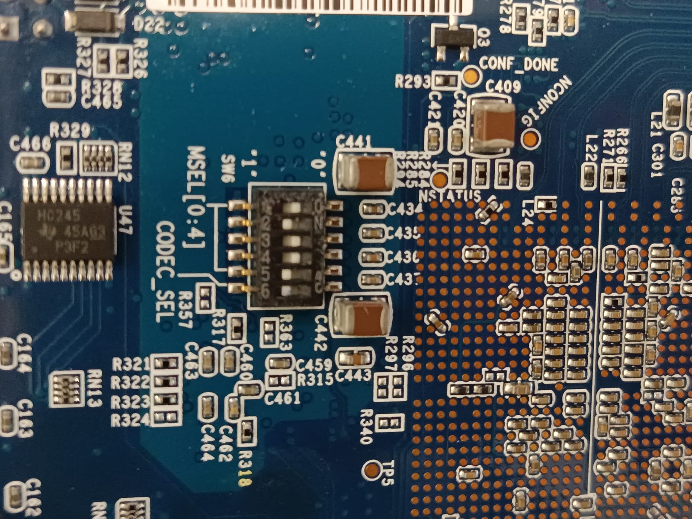
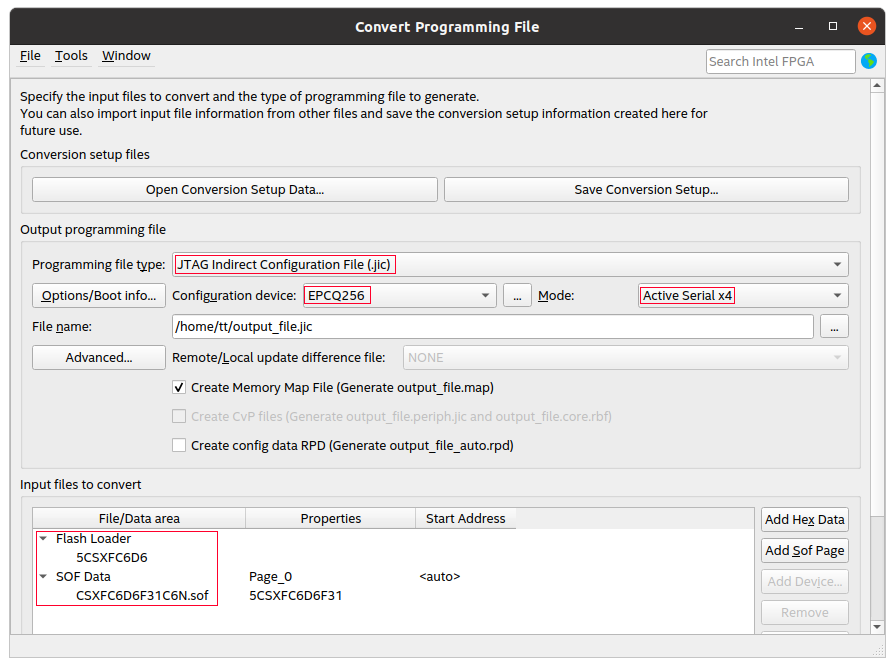
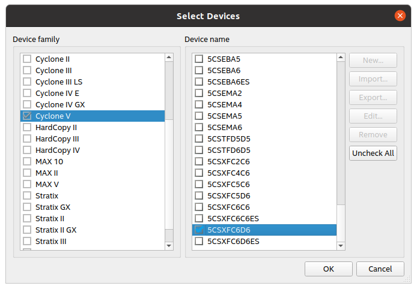
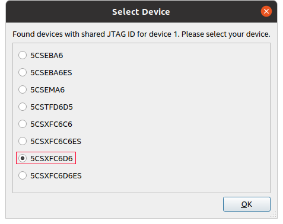
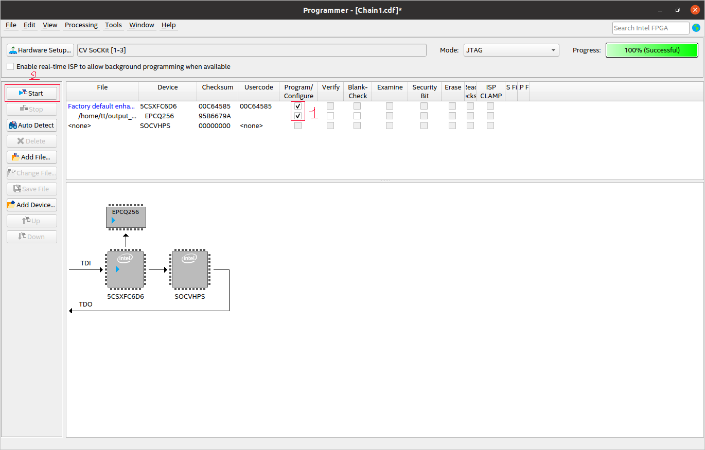
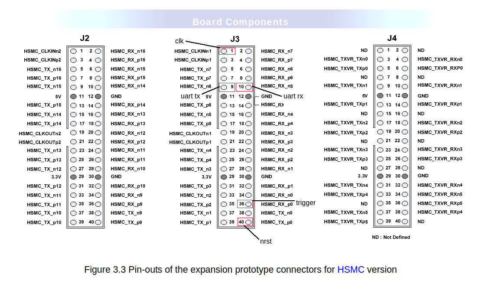
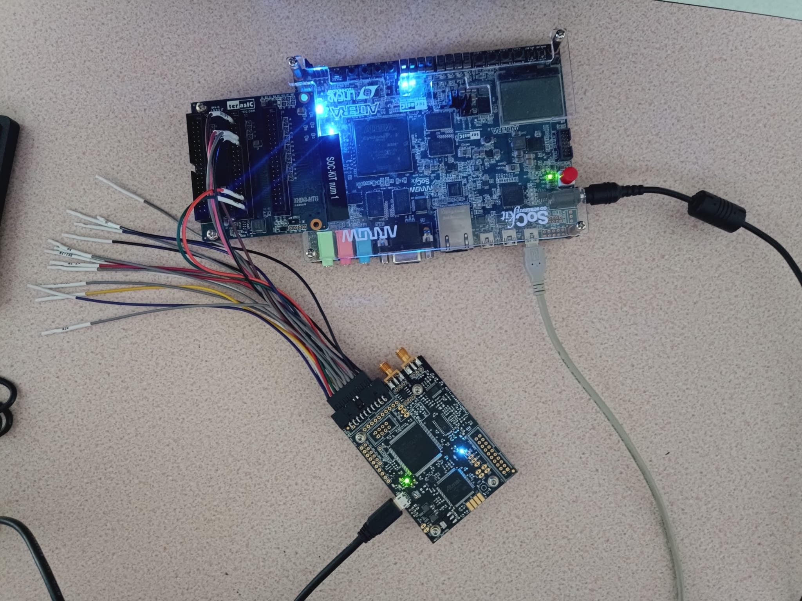
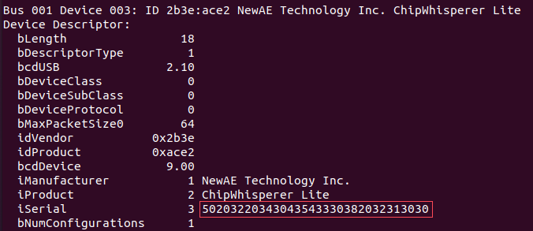
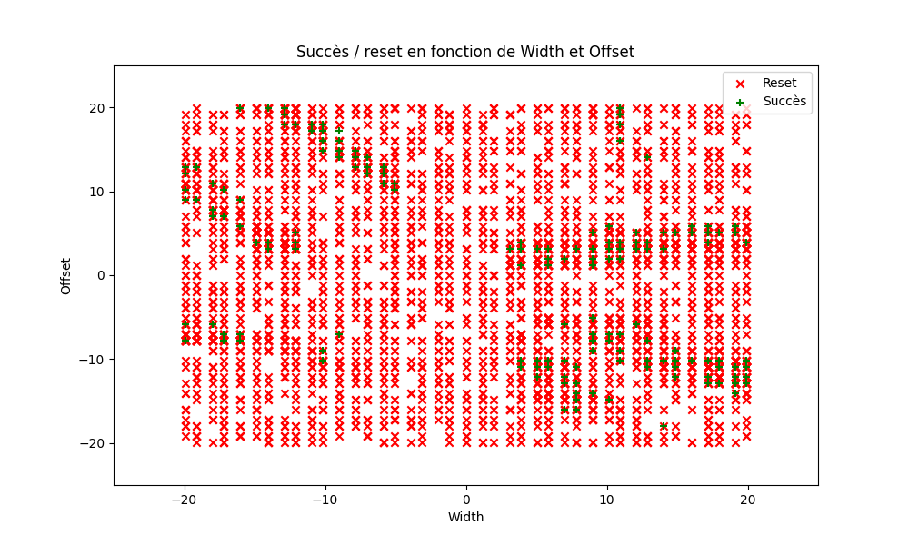

# Clock Glitching sur la configuration du PMP (mode NAPOT) de VexRiscv sur une Terasic SoCKit en bare-metal

Fait sur une machine virtuelle Ubuntu 20.04.06 avec Oracle VM VirtualBox 7.0.18

## INSTALLER QUARTUS

Télécharger l'Intel® Quartus® Prime Lite Edition Installer (SFX) [ici](https://www.intel.com/content/www/us/en/software-kit/825277/intel-quartus-prime-lite-edition-design-software-version-23-1-1-for-linux.html)
```bash
cd ~/Downloads/
chmod +x qinst-lite-linux-23.1std.1-993.run
./qinst-lite-linux-23.1std.1-993.run
```
Cocher Cyclone V device support et cliquer sur Download




```bash
echo "export PATH=$HOME/intelFPGA_lite/23.1std/quartus/bin:$PATH" >> ~/.bashrc
source ~/.bashrc

sudo gedit /etc/udev/rules.d/51-usbblaster.rules
```
Mettre :
```
# USB Blaster
SUBSYSTEM=="usb", ENV{DEVTYPE}=="usb_device", ATTR{idVendor}=="09fb", ATTR{idProduct}=="6001", MODE="0666", NAME="bus/usb/$env{BUSNUM}/$env{DEVNUM}", RUN+="/bin/chmod 0666 %c"
SUBSYSTEM=="usb", ENV{DEVTYPE}=="usb_device", ATTR{idVendor}=="09fb", ATTR{idProduct}=="6002", MODE="0666", NAME="bus/usb/$env{BUSNUM}/$env{DEVNUM}", RUN+="/bin/chmod 0666 %c"
SUBSYSTEM=="usb", ENV{DEVTYPE}=="usb_device", ATTR{idVendor}=="09fb", ATTR{idProduct}=="6003", MODE="0666", NAME="bus/usb/$env{BUSNUM}/$env{DEVNUM}", RUN+="/bin/chmod 0666 %c"

# USB Blaster II
SUBSYSTEM=="usb", ENV{DEVTYPE}=="usb_device", ATTR{idVendor}=="09fb", ATTR{idProduct}=="6010", MODE="0666", NAME="bus/usb/$env{BUSNUM}/$env{DEVNUM}", RUN+="/bin/chmod 0666 %c"
SUBSYSTEM=="usb", ENV{DEVTYPE}=="usb_device", ATTR{idVendor}=="09fb", ATTR{idProduct}=="6810", MODE="0666", NAME="bus/usb/$env{BUSNUM}/$env{DEVNUM}", RUN+="/bin/chmod 0666 %c"
```

```bash
sudo udevadm control --reload-rules && udevadm trigger
```
## INSTALLER LITEX ET CREER LE SOC

```bash
cd && mkdir litex && cd litex
python3 -m venv pyenv
source pyenv/bin/activate
wget https://raw.githubusercontent.com/enjoy-digital/litex/master/litex_setup.py
chmod +x litex_setup.py
./litex_setup.py --tag=2023.12 --init --install --config=full
pip3 install meson ninja
sudo ./litex_setup.py --gcc=riscv
mv CSXFC6D6F31C6N_PLATFORMS.py $HOME/litex/litex-boards/litex_boards/platforms/CSXFC6D6F31C6N.py
chmod +x CSXFC6D6F31C6N_TARGETS.py && mv CSXFC6D6F31C6N_TARGETS.py $HOME/litex/litex-boards/litex_boards/targets/CSXFC6D6F31C6N.py

./litex-boards/litex_boards/targets/CSXFC6D6F31C6N.py --cpu-type=vexriscv --cpu-variant=secure --sys-clk-freq=25e6 --no-compile-gateware --build
```
Dans le dossier qui contient le programme à mettre dans la ROM :

```bash
./glitch-pmp.py --build-path ~/litex/build/CSXFC6D6F31C6N/ --mem=rom
```
```bash
cd ~/litex
./litex-boards/litex_boards/targets/CSXFC6D6F31C6N.py --cpu-type=vexriscv --cpu-variant=secure --sys-clk-freq=25e6 --integrated-rom-init ~/testpmp-vex/glitch-pmp.bin --build
deactivate
```

Pour charger le SoC généré : 
```bash
quartus_pgm -c "CV SoCKit" -m JTAG -o "p;$HOME/litex/build/CSXFC6D6F31C6N/gateware/CSXFC6D6F31C6N.sof"
```
Pour charger le SoC dans la mémoire flash :

Mettre les MSEL de SW6 de cette façon :




Aller dans Quartus --> File --> Convert Programming File

Choisissez ces paramètres : 



Pour le Flash Loader --> Add Device, cliquer sur Cyclone V et 5CSXFC6D6



Pour le SOF Data --> mettre le fichier sof généré par LiteX

Une fois le fichier jic créé, aller sur Quartus --> Tools --> Programmer --> Auto Detect et prendre




Cliquer sur le 5CSXFC6D6 du schéma --> Change File et mettez le fichier jic


Une fois cela fait, cocher Program/Configure et appuyer sur start et le bitstream sera dans la flash de l'EPCQ256



## SETUP

Comme dans le fichier platforme CSXFC6D6F31C6N.py, nous avons indiqué que la clock (fourni par le chipwhisperer) sera sur le pin-out 1 du J3, le trigger pour indiquer au chipwhisperer que c'est à ce moment précis qu'il faut attaquer sera sur le pin-out 36 du J3, le nrst qui permet de réinitialiser le FPGA lorsqu'il n'y a pas eu de succès d'attaque sera sur le pin-out 40 du J3 et finalement l'uart sera sur les pin-outs 9 et 10 du J3 pour TX et RX respectivement.



Pour le branchement, nous mettons les câbles HS2/OUT sur le pin-out 1, IO1/TX sur le pin-out 9, IO2/RX sur le pin-out 10, GND sur le pin-out 12, IO4/TRIGGER sur le pin-out 36 et enfin le NRST sur le pin-out 40

Pour plus d'informations sur les pins du chipwhisperer : [ici](http://wiki.newae.com/CW1173_ChipWhisperer-Lite/20-Pin_Connector)



## CLOCK GLITCHING

```bash
git clone https://github.com/KevinQhv/ClockFaultInjector && cd ClockFaultInjector
pip3 install -r requirements.txt
pip3 install chipwhisperer matplotlib
```
Dans ClockFaultInjector.py --> ajouter import matplotlib.pyplot as plt.

Commenter les :
 - ```parser.add_argument (name-board,ftdi-FPGA,freq-load-bit)```
 - ```file.write(f"FPGA setup is the {args.ftdi_FPGA} \n")```
 
Pour les 3 commandes : ```tk.reboot_bitstream(args.name_board, args.ftdi_FPGA, args.freq_load_bit, args.bitstream_file)```, ne laisser que ```args.bitstream_file``` en paramètre
 
Dans ```src/cw_toolkit.py``` --> dans la fonction ```reboot_bitstream```, laisser que le paramètre bistream en entrée.\
Commenter les lignes ```IDProduct_FPGA``` et ```Frequency``` et remplacer command par ```command = 'quartus_pgm -c "CV SoCKit" -m JTAG -o "p;"' + bistream```

```
sudo gedit /etc/udev/rules.d/99-newae.rules
```
Mettre : 

```bash
# CW-Lite
SUBSYSTEM=="usb", ATTRS{idVendor}=="2b3e", ATTRS{idProduct}=="ace2", MODE="0666", GROUP="plugdev"
# CW-1200
SUBSYSTEM=="usb", ATTRS{idVendor}=="2b3e", ATTRS{idProduct}=="ace3", MODE="0666", GROUP="plugdev"
# CW-305 (Artix Target)
SUBSYSTEM=="usb", ATTRS{idVendor}=="2b3e", ATTRS{idProduct}=="c305", MODE="0666", GROUP="plugdev"
# CW-CR2
SUBSYSTEM=="usb", ATTRS{idVendor}=="04b4", ATTRS{idProduct}=="8613", MODE="0666", GROUP="plugdev"
SUBSYSTEM=="usb", ATTRS{idVendor}=="221a", ATTRS{idProduct}=="0100", MODE="0666", GROUP="plugdev"
```
```bash
sudo usermod -aG plugdev $USER
sudo udevadm control --reload-rules && udevadm trigger
```
Puis se déconnecter et se reconnecter à votre session, et brancher votre câble USB du chipwhisperer

Pour obtenir le serial number du chipwhisperer, il faut faire : 
```bash
lsusb -v
```


On peut maintenant commencer les attaques : 

```bash
python3 ClockFaultInjector.py --sn-chipwhisperer=50203220343043543330382032313030 --bitstream-file $HOME/litex/build/CSXFC6D6F31C6N/gateware/CSXFC6D6F31C6N.sof --path-exp=. --csv-log=cg.csv
```
Pour plus d'informations sur les paramètres d'entrés de la fonction faire :
```bash
python3 ClockFaultInjector.py --help
```

Après avoir réalisé la campagne d'évaluation de sécurité, nous allons produire un graphique indiquant les succès obtenus en utilisant les paramètres du fichier csv généré.

```python
import pandas as pd
import matplotlib.pyplot as plt
from pathlib import Path

home = Path.home()
filename = home / "ClockFaultInjector" / "cg.csv"
df = pd.read_csv((filename), header=None, names=["iteration", "status", "width", "offset", "ext_offset", "pmpcfg0", "pmpcfg2", "pmpaddr0", "pmpaddr1", "pmpaddr2", "pmpaddr3", "pmpaddr4", "pmpaddr5", "pmpaddr6", "pmpaddr7"])

success_df = df[df['status'] == 'success']
reset_df = df[df['status'] == 'reset']

plt.figure(figsize=(10, 6))
plt.scatter(reset_df['width'], reset_df['offset'], c='red',marker="x", label='Reset')
plt.scatter(success_df['width'], success_df['offset'], c='green',marker="+", label='Succès')

plt.title("Succès / reset en fonction de Width et Offset")
plt.xlabel("Width")
plt.ylabel("Offset")

plt.xlim(-50, 50)
plt.ylim(-50, 50)

plt.legend()
plt.grid(False)
plt.savefig('cg.png')
plt.show()
```

Ça donnera quelque chose comme ça pour une campagne de sécurité avec comme paramètres :
- width = -20 | 20
- offset = -20 | 20
- ext_offset = 110 | 130



